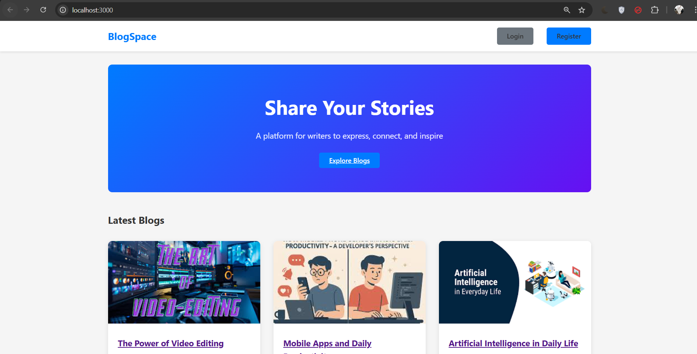
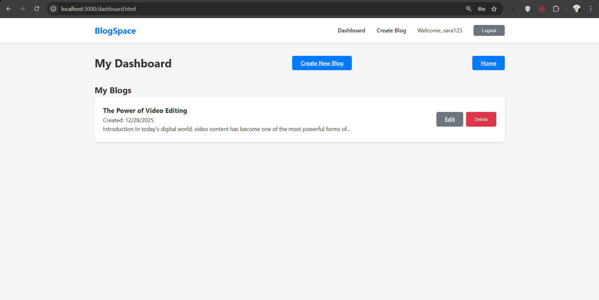
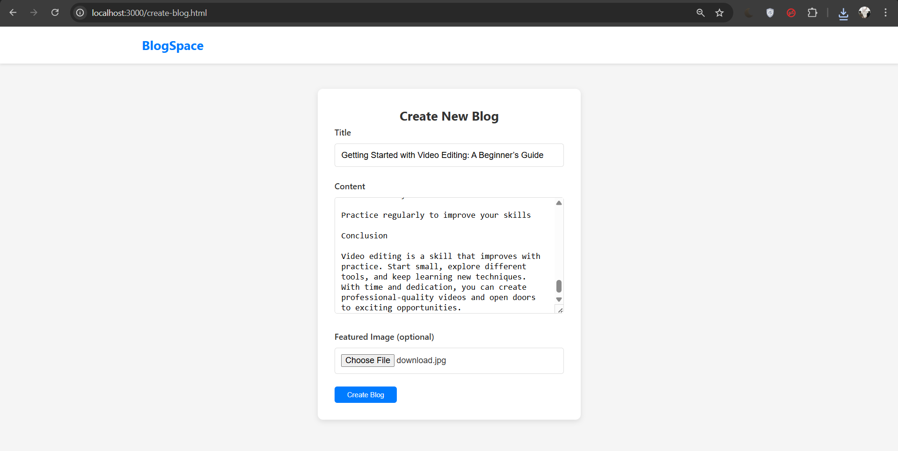
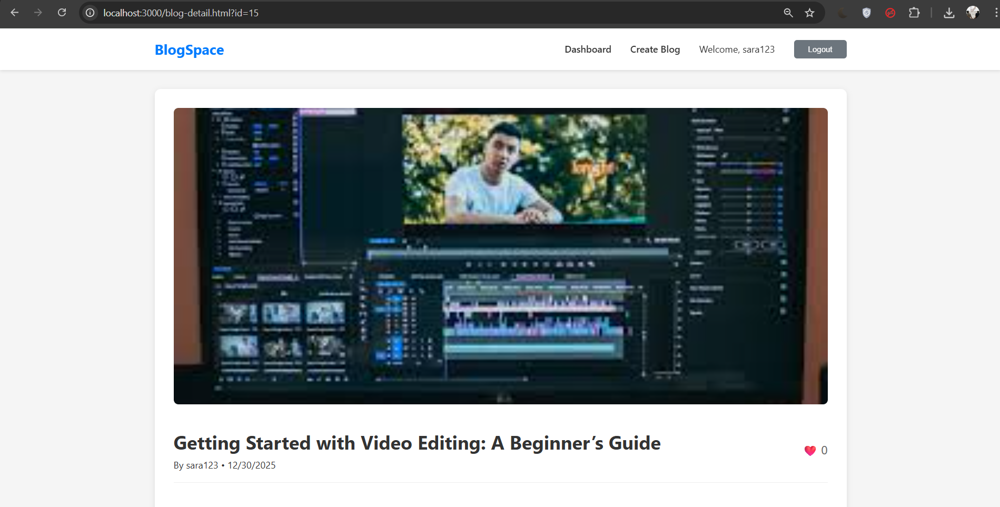
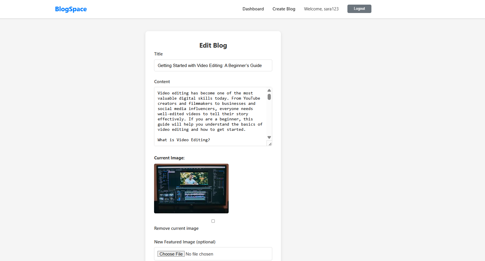

# Blogging Platform – Medium-Lite Version

A full-stack **Blogging Web Application** built as part of **Internship Task 5**.
This platform allows users to **write, publish, edit, and manage blogs**, while readers can **view, like, and comment on posts** — similar to a simplified Medium.

---

## 📸 Screenshots

### Home / Public Feed



### User Dashboard



### Create Blog



### Blog Detail Page



### Edit Blog



---

## 🚀 Features

### 🔐 Authentication

* User Registration & Login
* JWT-based authentication
* Secure password hashing using **bcrypt**
* User-specific blog access control

### ✍️ Blogs

* Create new blog posts
* Edit & delete own blogs
* Upload blog cover images
* Rich blog content support
* Author name & publish date shown

### 🌍 Public Blog Feed

* View all published blogs
* Latest blogs shown first
* Blog preview cards
* Open full blog detail page

### ❤️ Likes

* Like & unlike blog posts
* Like count displayed in feed & blog detail
* Per-user like tracking

### 💬 Comments

* Add comments on blogs
* View all comments per blog
* Comment author & date shown

### 📊 Dashboard

* View all blogs created by logged-in user
* Quick edit & delete options
* Blog creation history

---

## 🛠️ Tech Stack

### Frontend

* HTML5
* CSS3
* JavaScript (Vanilla JS)

### Backend

* Node.js
* Express.js
* JWT Authentication
* bcrypt.js
* Multer (Image Upload)

### Database

* MySQL

---

## 📁 Project Structure

```
BLOGGING-PLATFORM/
│
├── css/
│   └── style.css
├── js/
│   └── script.js
├── uploads/
├── database/
├── screenshots/
│
├── index.html
├── login.html
├── register.html
├── dashboard.html
├── create-blog.html
├── edit-blog.html
├── blog-detail.html
│
├── server.js
├── package.json
├── package-lock.json
├── .env
└── README.md
```

---

## ⚙️ Installation & Setup

### 1️⃣ Clone the Repository

```bash
git clone https://github.com/GirishaPriyadharsini/YOUR_REPO_NAME.git
cd YOUR_REPO_NAME
```

### 2️⃣ Install Dependencies

```bash
npm install
```

### 3️⃣ Configure Environment Variables

Create a `.env` file:

```env
PORT=3000
DB_HOST=localhost
DB_USER=root
DB_PASSWORD=your_password
DB_NAME=blogging_platform
JWT_SECRET=your_secret_key
```

---

### 4️⃣ Setup Database

* Create a MySQL database named `blogging_platform`
* Import the SQL file:

```sql
source blogging_platform.sql;
```

---

### 5️⃣ Run the Server

```bash
node server.js
```

Open in browser:

```
http://localhost:3000
```

---

## 🔐 API Highlights

* `POST /api/register` – Register user
* `POST /api/login` – Login user
* `GET /api/blogs` – Public blog feed
* `GET /api/my-blogs` – User’s blogs
* `POST /api/blogs` – Create blog
* `PUT /api/blogs/:id` – Update blog
* `DELETE /api/blogs/:id` – Delete blog
* `POST /api/blogs/:id/like` – Like / Unlike blog
* `POST /api/blogs/:id/comments` – Add comment

All protected routes use **JWT authentication**.

---

## 🎯 Internship Objective Fulfilled

✔ User authentication
✔ Blog creation & management
✔ Image upload functionality
✔ Public blog feed
✔ Like & comment system
✔ Secure user-specific backend storage

---

## 👩‍💻 Developed By

**Girisha Priyadharsini M**
Internship Task 5 – Blogging Platform (Medium-Lite Version)

---

## 📄 License

This project is developed for **educational and internship purposes only**.

---
